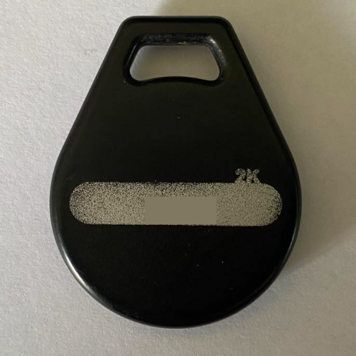

# iCLASS_Brute-force
## Summary ##
By default using the PicoPass application on a FlipperZero to brute-force an iCLASS key fob has a very small number of keys available which results in a low success rate. This can be improved by including the 700+keys in the iCopyX leak. The exact iCLASS key fob is shown in the images below. The firmware used for this attack is Unleashed Development version with extra apps (878E). 

## Problem 

When attempting an attack using the built in Elite Dict.Attack method found in the PicoPass application only    25 or 28 keys are actually tried. 

## Updating the keys file

On the version of Unleashed firmware that I'm running the key file for the dictionary attack is located at `SD Card/apps_assets/picopass/iclass_elite-dict.txt`

The actual contents of the file looks like this. Although the screenshot above shows 28 keys being attempted the file actually only contains 25 so not sure what the true number is. 

The actual leak of the 700+ from keys from iCopyX can be found in here. https://pastebin.com/raw/KWcu0ch6

The original file as shown above is stored in this repo as `iclass_elite_dict_original.txt` so if you want to restore later you can just rename this file to `iclass_elite_dict.txt` and copy it back to your FlipperZero in the original location of `SD Card/apps_assets/picopass/iclass_elite-dict.txt`.  

1. Copy the file from the SDCard to do this you can either remove the SDCARD or use the qFlipper application or just download the one attached to this repo. 
2. Copy all of the keys from pastebin link above and paste them into the file you downloaded. I put them after the key `C1B74D7478053AE2` but I'm not sure it would really matter. 

3. Your key file should look like the below screenshot. 

4. Now just use your preferred method to transfer this file back to the flipper if you are using qFlipper you may have to delete the original file first. 

## Attack with extra keys

After re-running the attack many more keys are shown to be tried. 

After trying 300 odd keys very quickly the correct one was found. 

From here I was able to save the key. 

I have not yet been able to get this working by writing it to another blank key fob however I was able to successfully emulate the key fob using the FlipperZero and have it open the door. 

